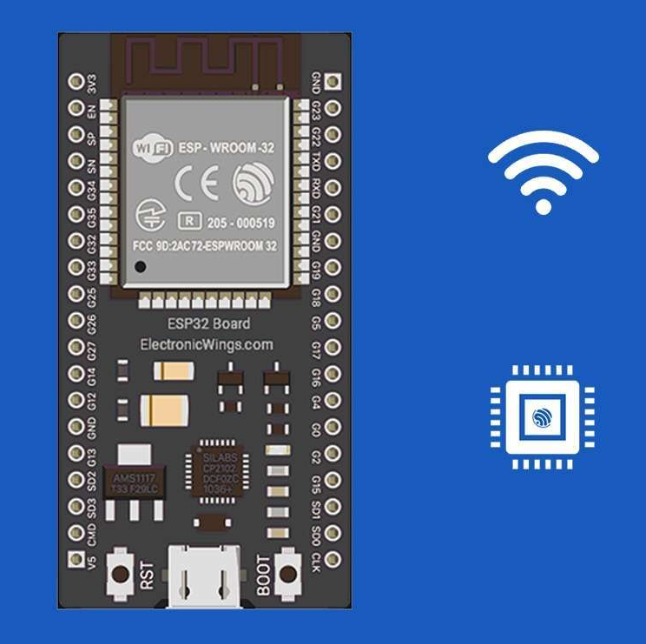

  <h1 align="center"><strong>ESP MONITORING API</strong></h1> 
 API em <b>Node.js</b> com <b>Typescript</b> para coletar dados de sensores (DHT11, LDR e MQ-135) via <b>ESP32</b> 🚀 
 
   <!-- Badges --> 

🚀 Tecnologias

Este projeto foi desenvolvido com as seguintes tecnologias:

📦 Dependências principais

express
 - Framework web para Node.js

sequelize
 + mysql2
 - ORM e driver MySQL

[typescript][typescript-npm] - Superset para desenvolvimento em escala

dotenv
 - Variáveis de ambiente

nodemon
 - Reload automático no desenvolvimento

📄 Estrutura de Arquivos

.gitignore - Ignora node_modules, dist e arquivos sensíveis

.env - Variáveis de ambiente (porta, banco, etc.)

tsconfig.json - Configurações do TypeScript

src/models - Models Sequelize (User, Device, Reading)

src/controllers - Controladores da API

src/services - Regras de negócio

src/repositories - Acesso ao banco

src/routes - Rotas da API

⚡ Scripts

npm run start:dev → roda a API em modo desenvolvimento (com nodemon)

npm run start:dist → compila e executa a versão em dist/

npm run build → gera build TypeScript para JavaScript em dist/

📡 Funcionalidades

Cadastro de usuários e dispositivos (com apiKey)

Recebimento de leituras de sensores (temperature, humidity, luminosity, gas)

Associação automática entre device ↔ reading via apiKey

Endpoints para:

Listar todas as leituras

Buscar leituras por deviceId

Última leitura de um dispositivo

Leituras filtradas por período

👨‍💻 Como usar
Requisitos

Git

Node.js v20+

MySQL 8+

Passo a passo
# Clone o repositório
$ git clone https://github.com/LukasBariani/API-NODE-ESP

# Entre na pasta
$ cd API-NODE-ESP

# Instale as dependências
$ npm install

# Rode
$ npm run start:dev

A API estará disponível em:
👉 http://localhost:3333/api

🔌 Integração com o ESP32

O ESP32 coleta dados dos sensores e envia para a API:

DHT11 → Temperatura (°C) e Umidade (%)

LDR → Luminosidade (valor analógico)

MQ-135 → Qualidade do ar (valor analógico)

Exemplo de payload enviado:

{
  "temperature": 23.5,
  "humidity": 48,
  "luminosity": 512,
  "gas": 289
}

Com cabeçalho:

x-api-key: def456

👤 Autor
 Lukas Rodrigues Bariani

Baseado no node-blue-boilerplate